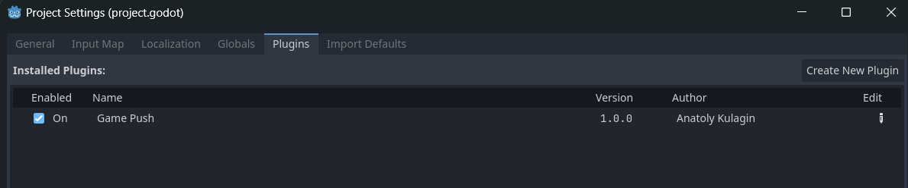
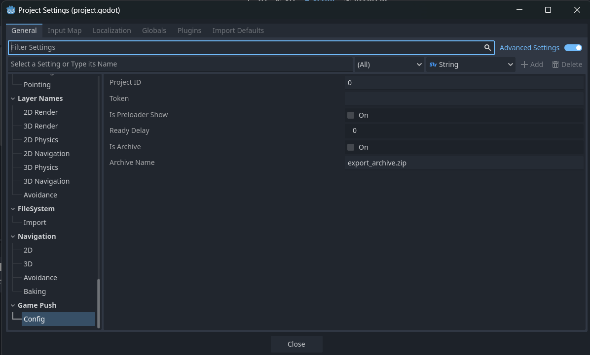

# Getting Started with Godot

> The GamePush plugin for Godot supports engine versions 4.0 and higher.

## Plugin Installation
1. Install the plugin through the Godot Asset Library or by downloading the project folder from GitHub.
  
2. Navigate to the plugins panel in the project settings `Project -> Project Settings -> Plugins` and enable the GamePush plugin.


## Project Configuration
1. Go to the plugin settings panel `Project -> Project Settings -> Game Push -> Config`.


2. In the plugin settings, enter the public key (`token`) and project ID (`Project ID`) from the GamePush dashboard.
3. If you want to show an ad immediately upon opening the game, check the box for `Is Preloader Show`.
4. If you want the GameReady event to trigger automatically right after plugin initialization, set the delay to 0. If you want to delay the GameReady event, specify the delay in seconds. If you want to disable automatic triggering of GameReady, set a negative value.
5. If you want to automatically save your web build as an archive, check the box for `Is Archive`. You can also specify the name of the archive.
> For proper archiving, ensure that the export folder contains only the archive and project files. Before the first export, the folder should be empty.

## Usage
The `GP` singleton, which contains GamePush modules, is available for use. You can access the modules via the singleton from any script in your project.

### Initialization
To use the plugin, you need to wait for the GamePush library to initialize. Subscribe to the signal `GP.init(success:bool)`.

#### Example of Waiting for Initialization

```gdscript
func _ready():
    # If the GamePush plugin was loaded before this scene's initialization
    if GP.is_inited:
        go_to_main_scene()
        return
    GP.inited.connect(go_to_main_scene)

func go_to_main_scene(_is_success_init:bool=false):
    # Switch to the project's main scene, for example, the main menu
    get_tree().change_scene_to_file("res://path/to/your/scene.tscn")

### Displaying Rewarded Ads

```gdscript
func _ready():
    GP.Ads.rewarded_reward.connect(add_25_coins)
    GP.Ads.rewarded_close.connect(func(success):
        if !success:
            GP.Logger.log("Close ads without reward"))

func add_25_coins():
    # On successful ad view, the player receives 25 coins
    GP.Player.add_value("coins", 25)

func show_reward_ad():
    # Display a rewarded video ad
    # The `true` parameter enables a countdown before the video is shown
    GP.Ads.show_rewarded_video(true)

```

## Notes
1. The plugin comes with a demo project, which contains examples of using the plugin methods.
2. The plugin largely mirrors the structure of the JS library. You can refer to the documentation for a deeper understanding.

